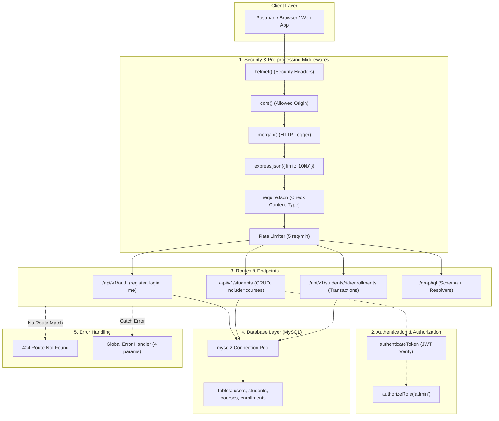

# 🎓 สรุปเนื้อหา & คู่มือติวสอบ Backend API Development (student-api)
> **วิชา:** การพัฒนาเว็บเซอร์วิสและเว็บเอพีไอ (Web API Development)  
> **โปรเจกต์:** `student-api` | **ภาษาและเฟรมเวิร์ก:** Node.js, Express.js, MySQL, GraphQL  
> **ผู้จัดทำสรุป:** สำหรับเตรียมตัวสอบและทบทวนความรู้รายสัปดาห์

---

## 📌 สารบัญ (Table of Contents)
1. [ภาพรวมสถาปัตยกรรมและเทคโนโลยี (Architecture Overview)](#1-ภาพรวมสถาปัตยกรรมและเทคโนโลยี)
2. [เจาะลึกเนื้อหารายสัปดาห์ (Week-by-Week Breakdown)](#2-เจาะลึกเนื้อหารายสัปดาห์)
   - [Week 1: พื้นฐาน REST API & Express.js](#week-1-พื้นฐาน-rest-api--expressjs)
   - [Week 2: ความรู้และพื้นฐาน GraphQL](#week-2-ความรู้และพื้นฐาน-graphql)
   - [Week 3: การออกแบบ RESTful URI, PUT vs PATCH & Query Params](#week-3-การออกแบบ-restful-uri-put-vs-patch--query-params)
   - [Week 4: Middlewares, Security Headers & Centralized Error Handling](#week-4-middlewares-security-headers--centralized-error-handling)
   - [Week 5: MySQL Database, Relations, Transactions & Concurrency Control](#week-5-mysql-database-relations-transactions--concurrency-control)
   - [Week 6-7: Authentication, Password Hashing, JWT & RBAC](#week-6-7-authentication-password-hashing-jwt--rbac)
3. [ตารางสรุปเร็ว (Cheat Sheet & Quick Reference)](#3-ตารางสรุปเร็ว-cheat-sheet)
4. [คลังข้อสอบและคำถามยอดฮิตพร้อมเฉลย (Exam Q&A)](#4-คลังข้อสอบและคำถามยอดฮิตพร้อมเฉลย)

---


## 1. ภาพรวมสถาปัตยกรรมและเทคโนโลยี



---

## 2. เจาะลึกเนื้อหารายสัปดาห์

---

### Week 1: พื้นฐาน REST API & Express.js

#### 📖 แนวคิดสำคัญ (Key Concepts)
1. **REST (Representational State Transfer):** รูปแบบสถาปัตยกรรมสำหรับการสื่อสารข้อมูลระหว่าง Client และ Server โดยใช้มาตรฐานของโปรโตคอล HTTP
2. **HTTP Methods (Verbs):**
   * `GET`: ดึงข้อมูล (Read) – ไม่มี Request Body
   * `POST`: สร้างข้อมูลใหม่ (Create) – ส่งข้อมูลใน Request Body
   * `PUT`: แก้ไข/แทนที่ข้อมูลเดิมทั้งชุด (Replace)
   * `DELETE`: ลบข้อมูล (Delete)
3. **การเข้าถึงข้อมูลของคำขอใน Express:**
   * `req.params`: ข้อมูลจาก Route Path เช่น `/students/:id` $\rightarrow$ `req.params.id`
   * `req.body`: ข้อมูล JSON ที่ส่งมาทาง Body (ต้องเรียก `app.use(express.json())` ก่อน)
   * `req.headers`: ข้อมูล Header ของคำขอ เช่น `req.headers['authorization']`
4. **HTTP Status Code พื้นฐาน:**
   * `200 OK`: ทำงานสำเร็จ (GET, PUT, PATCH, DELETE)
   * `201 Created`: สร้าง Resource ใหม่สำเร็จ (POST)
   * `400 Bad Request`: Client ส่งข้อมูลไม่ครบหรือไม่ถูกต้อง
   * `404 Not Found`: ไม่พบ Resource หรือ URL ที่เรียกหา

#### 💻 ตัวอย่างโค้ด Week 1
```javascript
const express = require('express');
const app = express();
app.use(express.json());

// In-Memory Data
let students = [
  { id: 1, name: "สมชาย ใจดี", major: "วิทยาการคอมพิวเตอร์" }
];

// GET: ดึงข้อมูล
app.get('/api/v1/students', (req, res) => {
  res.status(200).json({ message: "สำเร็จ", data: students });
});

// POST: เพิ่มข้อมูล
app.post('/api/v1/students', (req, res) => {
  const { name, major } = req.body;
  if (!name || !major) {
    return res.status(400).json({ error: "กรุณาระบุข้อมูลให้ครบ" });
  }
  const newStudent = { id: students.length + 1, name, major };
  students.push(newStudent);
  res.status(201).json({ message: "สร้างสำเร็จ", data: newStudent });
});
```

---

### Week 2: ความรู้และพื้นฐาน GraphQL

#### 📖 แนวคิดสำคัญ (Key Concepts)
1. **ข้อจำกัดของ REST API:**
   * **Over-fetching:** ได้ข้อมูลเกินความต้องการ (เปลืองแบนด์วิดท์)
   * **Under-fetching:** ได้ข้อมูลไม่ครบ ต้องยิง API หลายรอบ (Multiple Round-trips)
2. **จุดเด่นของ GraphQL:**
   * มีเพียง Endpoint เดียว (`/graphql`)
   * Client เป็นผู้กำหนดฟิลด์ข้อมูลที่ต้องการอย่างแม่นยำ (Declarative Data Fetching)
3. **โครงสร้างของ GraphQL:**
   * **Schema (SDL - Schema Definition Language):** กำหนดพิมพ์เขียวของข้อมูล เช่น `type`, `Query`, `Mutation`, `input`
   * **Resolvers:** ฟังก์ชันที่ทำหน้าที่ไปดึงข้อมูลจริง (จาก Database หรือ Array) มาตอบตามที่ Schema ร้องขอ
   * **GraphiQL:** เครื่องมือ GUI บน Browser สำหรับทดสอบส่ง Query/Mutation

#### 💻 ตัวอย่างโค้ด Week 2 (`schema.js` & `resolvers.js`)
```graphql
# schema.js
type Student {
  id: ID!
  name: String!
  major: String!
  courses: [Course!]!
}

type Query {
  student(id: ID!): Student
  students(major: String): [Student!]!
}

input CreateStudentInput {
  name: String!
  major: String!
}

type Mutation {
  createStudent(input: CreateStudentInput!): Student!
}
```

```javascript
// resolvers.js
const root = {
  student: ({ id }) => students.find(s => s.id === Number(id)),
  students: ({ major }) => major ? students.filter(s => s.major === major) : students,
  createStudent: ({ input }) => {
    const newStudent = { id: Date.now(), ...input };
    students.push(newStudent);
    return newStudent;
  }
};
```

---

### Week 3: การออกแบบ RESTful URI, PUT vs PATCH & Query Params

#### 📖 แนวคิดสำคัญ (Key Concepts)
1. **กฎการตั้งชื่อ RESTful URI (Resource Naming Standards):**
   * ✅ ใช้ **คำนามพหูพจน์ (Plural Nouns)**: `/api/v1/students`
   * ✅ ใช้ **ตัวพิมพ์เล็กและขีดกลาง (kebab-case)**: `/api/v1/course-registrations`
   * ❌ **ห้ามใช้คำกริยาใน Path**: ไม่ใช้ `/getStudents`, `/createStudent`, `/deleteStudent`
2. **ความแตกต่างระหว่าง `PUT` vs `PATCH` (ออกสอบบ่อยมาก):**
   * **`PUT` (Full Replacement):** แทนที่ Resource เดิมทั้งหมดด้วยข้อมูลใหม่ ถ้าไม่ส่งฟิลด์ไหนมา ฟิลด์นั้นจะกลายเป็น `null` หรือหายไป
   * **`PATCH` (Partial Update):** แก้ไขเฉพาะบางฟิลด์ที่ระบุมา ฟิลด์ที่ไม่ได้ระบุจะคงค่าเดิมไว้
3. **Query Parameters กับความสัมพันธ์ของ Resource:**
   * ❌ Anti-pattern: `/api/v1/students/1/full` (ทำให้ URI รกและผิดหลัก Resource)
   * ✅ RESTful Standard: `GET /api/v1/students/1?include=courses`
4. **Status Codes เพิ่มเติม:**
   * `409 Conflict`: ข้อมูลขัดแย้งกับสิ่งที่มีอยู่ (เช่น อีเมลซ้ำ `DUPLICATE_EMAIL`)

#### 💻 ตัวอย่างโค้ด Week 3 (การทำ PATCH)
```javascript
app.patch("/api/v1/students/:id", async (req, res, next) => {
  const id = req.params.id;
  const { name, major, email } = req.body;

  try {
    const [rows] = await pool.query("SELECT * FROM students WHERE id = ?", [id]);
    if (rows.length === 0) {
      return res.status(404).json({ error: { code: "NOT_FOUND", message: "ไม่พบนักศึกษา" } });
    }

    const current = rows[0];
    // ถ้าไม่ส่งมา ให้ใช้ค่าเดิม (Partial Update)
    const newName = name !== undefined ? name : current.name;
    const newMajor = major !== undefined ? major : current.major;
    const newEmail = email !== undefined ? email : current.email;

    await pool.query(
      "UPDATE students SET name = ?, major = ?, email = ? WHERE id = ?",
      [newName, newMajor, newEmail, id]
    );

    res.status(200).json({ message: "แก้ไขสำเร็จ", data: { id, name: newName, major: newMajor, email: newEmail } });
  } catch (err) {
    if (err.code === "ER_DUP_ENTRY") {
      return res.status(409).json({ error: { code: "DUPLICATE_EMAIL", message: "อีเมลซ้ำ" } });
    }
    next(err);
  }
});
```

---

### Week 4: Middlewares, Security Headers & Centralized Error Handling

#### 📖 แนวคิดสำคัญ (Key Concepts)
1. **ลำดับการทำงานของ Middleware (Middleware Execution Order):**
   * Express ทำงานแบบบนลงล่าง ลำดับจึงสำคัญมาก:  
     `Security Header (Helmet)` $\rightarrow$ `CORS` $\rightarrow$ `Logger (Morgan)` $\rightarrow$ `Body Parser` $\rightarrow$ `Route Handlers` $\rightarrow$ `Error Handlers`
2. **แพ็กเกจรักษาความปลอดภัยและการทำงาน:**
   * **`helmet()`:** ตั้งค่า HTTP Headers เช่น `X-Content-Type-Options: nosniff`, `X-Frame-Options: SAMEORIGIN` ป้องกันการโจมตี
   * **`cors()`:** กำหนด Origin ที่ยอมรับคำขอ (ป้องกัน Cross-Origin Request ที่ไม่ได้รับอนุญาต)
   * **`morgan('dev')`:** บันทึก Log การยิง Request สำหรับ Debug
   * **`express.json({ limit: "10kb" })`:** จำกัดขนาด Request Body ป้องกัน Payload Bombing
   * **`express-rate-limit`:** จำกัดจำนวน Request ต่อช่วงเวลา (เช่น ป้องกัน Brute-force หรือ DoS)
3. **Custom Middleware (`requireJson`):**
   * ตรวจสอบ Header `Content-Type` ในคำขอที่มี Body (`POST`, `PUT`, `PATCH`) หากไม่ใช่ `application/json` ให้คืน Status `415 Unsupported Media Type`
4. **Global Error Handling Middleware:**
   * ต้องมี **4 พารามิเตอร์เสมอ** ได้แก่ `(err, req, res, next)`
   * ถูกเรียกเมื่อใน Route มีการโยน Error ด้วย `next(err)`

#### 💻 ตัวอย่างโค้ด Week 4
```javascript
// 1. Custom Middleware ตรวจสอบ Content-Type
function requireJson(req, res, next) {
  const methodsWithBody = ["POST", "PUT", "PATCH"];
  const contentType = req.headers["content-type"];
  if (methodsWithBody.includes(req.method) && (!contentType || !contentType.includes("application/json"))) {
    return res.status(415).json({
      error: { code: "UNSUPPORTED_MEDIA_TYPE", message: "กรุณาส่งรูปแบบ application/json" }
    });
  }
  next(); // สำคัญมาก: ต้องเรียก next() เพื่อส่งต่อให้ Middleware ตัวถัดไป
}

// 2. Global Error Handler (ต้องมี 4 arguments)
app.use((err, req, res, next) => {
  console.error(err.stack);
  const statusCode = err.status || 500;
  res.status(statusCode).json({
    error: {
      code: statusCode === 500 ? "INTERNAL_SERVER_ERROR" : "ERROR",
      message: statusCode === 500 ? "เกิดข้อผิดพลาดภายในระบบ" : err.message
    }
  });
});
```

---

### Week 5: MySQL Database, Relations, Transactions & Concurrency Control

#### 📖 แนวคิดสำคัญ (Key Concepts)
1. **การเชื่อมต่อฐานข้อมูลด้วย Connection Pool (`mysql2/promise`):**
   * การใช้ Connection Pool ช่วยให้ไม่ต้องเปิด/ปิด TCP Socket ซ้ำซ้อน รองรับ Concurrent Users ได้ดีกว่า
2. **SQL Injection Prevention:**
   * **ห้ามต่อ String SQL เด็ดขาด** เช่น `"WHERE id = " + id`
   * ต้องใช้ **Parameterized Queries (`?`)** เช่น `pool.query("WHERE id = ?", [id])`
3. **การดึงข้อมูลสัมพันธ์ด้วย SQL JOIN:**
   ```sql
   SELECT c.id, c.course_name AS courseName, c.credit 
   FROM courses c
   JOIN enrollments e ON c.id = e.course_id
   WHERE e.student_id = ?
   ```
4. **Database Transactions & Pessimistic Locking (ระบบลงทะเบียนเรียน):**
   * **ปัญหา Race Condition:** หากเหลือที่นั่ง 1 ที่ แล้วมีคน 2 คนกดลงทะเบียนพร้อมกัน หากไม่มีการล็อก โควตาจะติดลบ และข้อมูลผิดพลาด (Data Inconsistency)
   * **การแก้ไข:** ใช้ **Transaction** ควบคู่กับ **`SELECT ... FOR UPDATE`** (Pessimistic Lock) เพื่อล็อกแถวข้อมูลของวิชานั้นไว้จนกว่า Transaction จะเสร็จสิ้น
   * **หลักการ ACID:**
     * **A (Atomicity):** สำเร็จทั้งหมด หรือยกเลิกทั้งหมด (Rollback)
     * **C (Consistency):** ข้อมูลคงความถูกต้องตามกฎทางธุรกิจเสมอ
     * **I (Isolation):** แต่ละ Transaction ทำงานแยกขาดจากกัน ไม่กวนกัน
     * **D (Durability):** ข้อมูลที่ Commit แล้วจะถูกบันทึกถาวร

#### 💻 ตัวอย่างโค้ด Week 5 (Transaction ปลอดภัยสำหรับลงทะเบียนเรียน)
```javascript
app.post("/api/v1/students/:id/enrollments", async (req, res, next) => {
  const studentId = req.params.id;
  const { courseId } = req.body;
  const connection = await pool.getConnection();

  try {
    // 1. เริ่มต้น Transaction
    await connection.beginTransaction();

    // 2. ค้นหาและล็อกแถวข้อมูลด้วย FOR UPDATE
    const [courses] = await connection.query(
      "SELECT * FROM courses WHERE id = ? FOR UPDATE",
      [courseId]
    );

    if (courses.length === 0) {
      await connection.rollback();
      return res.status(404).json({ error: "COURSE_NOT_FOUND" });
    }

    if (courses[0].seat_available <= 0) {
      await connection.rollback();
      return res.status(409).json({ error: "SEAT_FULL" });
    }

    // 3. เพิ่มข้อมูลลงทะเบียน
    await connection.query(
      "INSERT INTO enrollments (student_id, course_id) VALUES (?, ?)",
      [studentId, courseId]
    );

    // 4. ลดที่นั่งว่างลง 1
    await connection.query(
      "UPDATE courses SET seat_available = seat_available - 1 WHERE id = ?",
      [courseId]
    );

    // 5. บันทึก Transaction
    await connection.commit();
    res.status(201).json({ message: "ลงทะเบียนสำเร็จ" });
  } catch (err) {
    // หากมี Error ให้ Rollback ทั้งหมด
    await connection.rollback();
    if (err.code === "ER_DUP_ENTRY") {
      return res.status(409).json({ error: "ALREADY_ENROLLED" });
    }
    next(err);
  } finally {
    // สำคัญ: ต้องคืน Connection สู่ Pool เสมอ
    connection.release();
  }
});
```

---

### Week 6-7: Authentication, Password Hashing, JWT & RBAC

#### 📖 แนวคิดสำคัญ (Key Concepts)
1. **Authentication vs Authorization:**
   * **Authentication (AuthN):** ตรวจสอบว่า "คุณคือใคร?" (เช่น การ Login ด้วย Email + Password)
   * **Authorization (AuthZ):** ตรวจสอบว่า "คุณมีสิทธิ์ทำอะไรได้บ้าง?" (เช่น Admin มีสิทธิ์ลบข้อมูล แต่นักศึกษาไม่มีสิทธิ์)
2. **การจัดเก็บรหัสผ่านอย่างปลอดภัยด้วย `bcrypt`:**
   * **ห้ามเก็บรหัสผ่านแบบ Plain Text เด็ดขาด**
   * `bcrypt.hash(password, 10)`: นำรหัสผ่านไปผสม Salt (สุ่มข้อมูล) และคำนวณแบบทางเดียว (One-way Hash)
   * `bcrypt.compare(plain, hash)`: ฟังก์ชันเทียบรหัสผ่านตอน Login
3. **โครงสร้างของ JSON Web Token (JWT):**
   ```text
   [Header].[Payload].[Signature]
   ```
   * **Header:** ชนิดของ Token และ Algorithm (เช่น `HS256`)
   * **Payload:** ข้อมูลผู้ใช้ เช่น `{ id, email, role, exp }` (เข้ารหัสแบบ Base64Url **ไม่ได้เป็นการเข้ารหัสลับ** ทุกคนสามารถถอดอ่านได้!)
   * **Signature:** ลายมือชื่อดิจิทัลที่สร้างจาก `HMACSHA256(Base64(Header) + "." + Base64(Payload), SECRET)`
4. **กลไกการตรวจจับการปลอมแปลง Token (Avalanche Effect):**
   * หากผู้ใช้แอบแก้ไข Payload (เช่น แก้ `role: "student"` เป็น `role: "admin"`) เมื่อ Token ส่งมาที่ Server ตัว Server จะนำ Header และ Payload ใหม่ไปคำนวณ Signature ด้วย `JWT_SECRET` ของตนเอง
   * เนื่องจากคุณสมบัติ **Avalanche Effect** (การเปลี่ยนข้อมูลเพียงบิตเดียว ทำให้ Hash เปลี่ยนไปโดยสิ้นเชิง) Signature ที่ Server คำนวณใหม่จะไม่ตรงกับ Signature บน Token ส่งผลให้ `jwt.verify` ล้มเหลวและตอบกลับเป็น `401 Unauthorized (INVALID_TOKEN)` ทันที
5. **การป้องกัน Mass Assignment Vulnerability ในตอน Register:**
   * ในฟังก์ชัน Register ต้องบังคับให้ `role: 'student'` เสมอ ป้องกันไม่ให้ Client ส่ง Body `{ role: "admin" }` มายกระดับสิทธิ์ตนเอง
6. **การทำ RBAC (Role-Based Access Control) Middleware:**
   * `authenticateToken`: ตรวจสอบความถูกต้องของ JWT และแนบ Payload เข้า `req.user`
   * `authorizeRole(...allowedRoles)`: ตรวจสอบ `req.user.role` ถ้าไม่มีสิทธิ์จะส่ง `403 Forbidden`

#### 💻 ตัวอย่างโค้ด Week 6-7 (`middlewares/auth.js`)
```javascript
const jwt = require("jsonwebtoken");

// 1. Authenticate Token Middleware
function authenticateToken(req, res, next) {
  const authHeader = req.headers["authorization"];
  const token = authHeader && authHeader.split(" ")[1]; // รูปแบบ "Bearer <token>"

  if (!token) {
    return res.status(401).json({ error: { code: "NO_TOKEN", message: "กรุณาเข้าสู่ระบบก่อน" } });
  }

  try {
    const decoded = jwt.verify(token, process.env.JWT_SECRET);
    req.user = decoded; // เก็บ { id, email, role } ไว้ใน req.user
    next();
  } catch (err) {
    return res.status(401).json({ error: { code: "INVALID_TOKEN", message: "Token ไม่ถูกต้องหรือหมดอายุ" } });
  }
}

// 2. Authorize Role Middleware (RBAC)
function authorizeRole(...allowedRoles) {
  return (req, res, next) => {
    if (!req.user || !allowedRoles.includes(req.user.role)) {
      return res.status(403).json({ error: { code: "FORBIDDEN", message: "คุณไม่มีสิทธิ์เข้าถึงทรัพยากรนี้" } });
    }
    next();
  };
}

// การนำไปใช้งานปกป้อง Route
app.delete("/api/v1/students/:id", authenticateToken, authorizeRole("admin"), async (req, res, next) => {
  // เฉพาะ user ที่มี Token ถูกต้อง และมี role === 'admin' เท่านั้นที่จะเข้าถึงได้
});
```

---

## 3. ตารางสรุปเร็ว (Cheat Sheet)

### 📊 ตารางเปรียบเทียบ HTTP Status Codes

| Code | ชื่อ | ความหมาย | สถานการณ์ที่ใช้ในระบบ |
| :--- | :--- | :--- | :--- |
| **`200`** | OK | ทำงานสำเร็จ | GET ข้อมูล, PUT/PATCH แก้ไข, DELETE สำเร็จ |
| **`201`** | Created | สร้างสำเร็จ | POST เพิ่มนักศึกษา, Register, Enroll วิชา |
| **`400`** | Bad Request | คำขอไม่ถูกต้อง | ข้อมูลใน Request Body ไม่ครบถ้วนหรือไม่ผ่าน Validation |
| **`401`** | Unauthorized | ยังไม่ได้ยืนยันตัวตน | ไม่ส่ง Token, Token ปลอม/หมดอายุ, Email/Password ผิด |
| **`403`** | Forbidden | ไม่มีสิทธิ์ (Access Denied) | Token ถูกต้องแต่ Role ไม่ถึง (เช่น Student จะลบข้อมูล) |
| **`404`** | Not Found | ไม่พบทรัพยากร | ไม่พบ ID นักศึกษา, ไม่พบวิชา, ไม่มี Route นี้ |
| **`409`** | Conflict | ข้อมูลขัดแย้ง | อีเมลซ้ำในระบบ, ที่นั่งเต็ม, ลงทะเบียนวิชาเดิมซ้ำ |
| **`415`** | Unsupported Media Type | รูปแบบ Content ไม่รองรับ | ส่ง Body มาโดยไม่ระบุ `Content-Type: application/json` |
| **`429`** | Too Many Requests | คำขอถี่เกินไป | ยิง API ถี่เกินลิมิตของ Rate Limiter |
| **`500`** | Internal Server Error | ข้อผิดพลาดเซิร์ฟเวอร์ | Database หลุด, Unhandled Exception |

---

### 📊 ตารางเปรียบเทียบเทคโนโลยีสำคัญ

| หัวข้อ | เทคโนโลยี A | เทคโนโลยี B | สรุปความต่าง & จุดเลือกใช้ |
| :--- | :--- | :--- | :--- |
| **API Style** | **REST API** | **GraphQL** | REST เหมาะกับ Resource-based CRUD ทั่วไป ส่วน GraphQL เหมาะกับหน้าจอที่มีข้อมูลซับซ้อน ป้องกัน Over/Under-fetching |
| **Update Method** | **PUT** | **PATCH** | PUT แทนที่ข้อมูลทั้งชุด ส่วน PATCH แก้ไขเฉพาะฟิลด์ที่ส่งมา |
| **Security** | **Authentication (AuthN)** | **Authorization (AuthZ)** | AuthN ยืนยันว่าคุณคือใคร (401) ส่วน AuthZ ตรวจสอบว่าคุณทำสิ่งนี้ได้ไหม (403) |
| **Concurrency** | **Unsafe Query** | **Transaction + Lock** | Unsafe เสี่ยง Race Condition ที่นั่งติดลบ ส่วน Transaction + `FOR UPDATE` รับประกันความถูกต้องตามหลัก ACID |

---

## 4. คลังข้อสอบและคำถามยอดฮิตพร้อมเฉลย

### ❓ ข้อที่ 1: `PUT` และ `PATCH` แตกต่างกันอย่างไรในทางปฏิบัติ?
> **เฉลย:**  
> - **`PUT` (Full Update / Replace):** ใช้เมื่อต้องการแทนที่ข้อมูลของ Resource ทั้งชุด หาก Client ส่งข้อมูลมาเพียงบางฟิลด์ ฟิลด์ที่เหลือจะต้องถูกเซ็ตเป็นค่าว่าง หรือระบบต้องปฏิเสธคำขอ
> - **`PATCH` (Partial Update):** ใช้เมื่อต้องการแก้ไขเฉพาะบางฟิลด์ที่ระบุ โดยระบบจะดึงข้อมูลเดิมขึ้นมาและอัปเดตเฉพาะฟิลด์ใหม่ ส่วนฟิลด์ที่ไม่ได้ส่งมาจะคงค่าเดิมไว้

---

### ❓ ข้อที่ 2: ทำไมจึงห้ามนำค่าจาก `req.body` ไปต่อสตริงในคำสั่ง SQL ตรงๆ และแก้ไขอย่างไร?
> **เฉลย:**  
> - **สาเหตุ:** การนำ Input ไปต่อ String ใน SQL ตรงๆ (String Concatenation) จะก่อให้เกิดช่องโหว่ **SQL Injection** ซึ่งทำให้ผู้ไม่หวังดีสามารถแทรกคำสั่ง SQL อันตราย เช่น `' OR '1'='1` เข้ามาขโมยข้อมูลหรือทำลายฐานข้อมูลได้
> - **วิธีแก้ไข:** ใช้ **Parameterized Queries (`?`)** ของ Driver เช่น `pool.query("SELECT * FROM users WHERE email = ?", [email])` เพื่อให้ Database ทำ Pre-compilation และมอง Input เป็นเพียง Literal Value เสมอ

---

### ❓ ข้อที่ 3: หาก Client แก้ไขข้อมูล Payload ใน JWT Token (เช่น แก้ role จาก `student` เป็น `admin`) ทำไม Server ถึงตรวจจับได้ ทั้งๆ ที่ Payload ไม่ได้ถูกเข้ารหัสลับ?
> **เฉลย:**  
> - แม้ Payload จะเป็นเพียงข้อความ Base64Url แต่ JWT มีส่วนที่เรียกว่า **Signature** ซึ่งถูกคำนวณมาจาก `HMACSHA256(Base64(Header) + "." + Base64(Payload), SECRET)` โดยมีเพียง Server เท่านั้นที่รู้ `SECRET`
> - อัลกอริทึม Hash มีคุณสมบัติ **Avalanche Effect** (เปลี่ยนข้อมูลเพียง 1 บิต ค่า Hash จะเปลี่ยนไปโดยสิ้นเชิง)
> - เมื่อ Server นำ Payload ที่ถูกแก้ไขไปคำนวณ Signature ใหม่ จะพบว่า**ไม่ตรงกับ Signature ที่แนบมากับ Token** ส่งผลให้ฟังก์ชัน `jwt.verify` โยน Error และตอบกลับ `401 Unauthorized` ทันที

---

### ❓ ข้อที่ 4: จงอธิบายเหตุการณ์ Race Condition ในระบบลงทะเบียนเรียน และวิธีแก้ปัญหาด้วย Transaction?
> **เฉลย:**  
> - **เหตุการณ์:** หากวิชาหนึ่งเหลือที่นั่งว่างเพียง 1 ที่ แล้วมีนักศึกษา 2 คนกดลงทะเบียนเข้ามาในเสี้ยววินาทีเดียวกัน ทั้งสองคำขอจะอ่านค่า `seat_available = 1` ผ่านทั้งคู่ และทำการ Insert ข้อมูลลงทะเบียน พร้อมกับลดที่นั่งลง 1 ส่งผลให้ที่นั่งกลายเป็น `0` หรือติดลบ และมีผู้ลงทะเบียนเกินโควตาจริง (Overbooking)
> - **วิธีแก้ปัญหา:**
>   1. ใช้ **Database Transaction** (`beginTransaction()`)
>   2. ใช้ **Pessimistic Locking** ด้วยคำสั่ง `SELECT * FROM courses WHERE id = ? FOR UPDATE` เพื่อล็อกแถวข้อมูลของวิชานั้นไว้ คำขอที่สองจะต้องรอจนกว่าคำขอแรกจะทำงานเสร็จ
>   3. ทำการตรวจสอบที่นั่ง หากไม่พอให้ `rollback()` หากพอให้ Insert และ Update ที่นั่ง แล้วทำการ `commit()`

---

### ❓ ข้อที่ 5: Middleware ใน Express ที่ทำหน้าที่เป็น Global Error Handler แตกต่างจาก Middleware ทั่วไปอย่างไร?
> **เฉลย:**  
> Global Error Handler จะต้องมี **พารามิเตอร์ 4 ตัวเสมอ** คือ `(err, req, res, next)` ในขณะที่ Middleware ทั่วไปจะมี 3 ตัว `(req, res, next)` Express จะใช้จำนวนของ Arguments (Arity) เป็นตัวระบุว่าฟังก์ชันนี้คือ Error Handler และจะถูกเรียกอัตโนมัติเมื่อมีการส่ง Error ผ่านคำสั่ง `next(err)`
